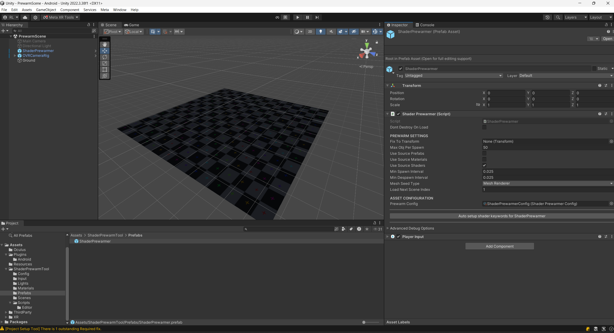
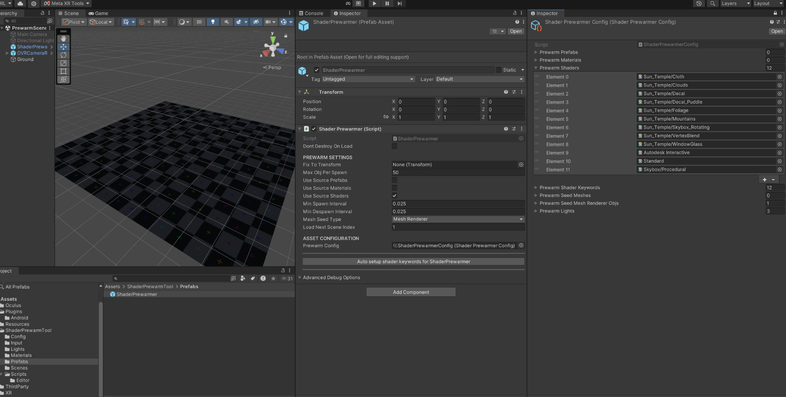
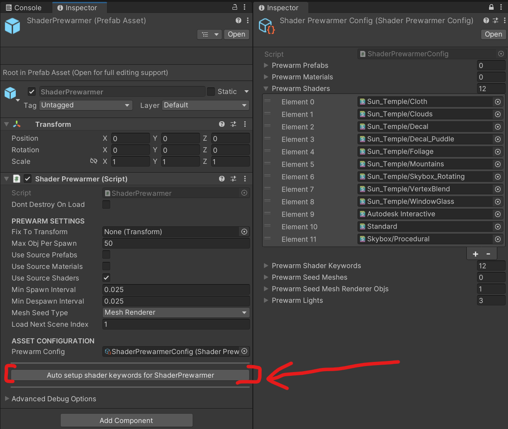

# Shader Prewarmer

*Shader Prewarmer* is both an utility sample you can integrate into your Unity project to prewarm your shader variants, and a reference sample for your own shader prewarming implementation. The goal of the sample is to provide XR developers an easy workflow to quickly set up and configure a shader prewarming pipeline within your application, which can help remove FTUX (first time user experience) shader glitching as much as possible at a lower development cost.

## Licenses

The majority of this Shader Prewarmer sample is licensed under MIT LICENSE. However, certain files and packages from Unity and any other third parties are licensed under their respective licensing terms.

# What is Shader Prewarming?

Shader prewarming is a technique used in computer graphics to improve the performance of shaders, which are small programs that run on the Graphics Processing Unit (GPU) to calculate and define the visual appearance of 3D objects.

Shader prewarming involves compiling and caching shader variants before they are actually needed. This process creates a pool of pre-compiled shaders that can be quickly retrieved and used when required, rather than being compiled on the fly when you app is running.

Shader compiling glitching is an unwanted FTUX phonomena if an app / game doesn't do shader prewarming properly, it is very important to eliminate shader glitching as much as possible, especailly for immersive applications.

# What does this sample do?

## Functionalities

The sample showcases some utility design ideas on how you can configure the materials, shaders, meshes, renderers and lights your apps / games might use in runtime, and how to automatically perform prewarm rendering of all valid combinations and permutations of the resources you set up in the config. The shader prewarming scripts in this sample are collectively a useful tool out of the box to help you prewarm your apps / games / levels.

***NOTE:** This tool is still in experimental state, certain features have not been fully tested / verified yet.*

* The target prewarm rendering frequencies and per-frame prewarm spawn count can be defined

* You can fix the whole runtime spawn setup to a camera transform

* You can choose a combination of several possible approaches to prewarm shader variants. For example:

  - Prewarm all possible prefabs that might be spawned in your game.
  - Prewarm all possible pre-defined materials with Mesh or MeshRenderer seeds
  - Prewarm all possible valid shaders' keyword combinations (shader variants) with Mesh or MeshRenderer seeds
  - Prewarm materials, shaders or prefabs with all possible lighting conditions (combinations) from a list of predefined light components.

* This utility / tool sample should work on both OpenGL and Vulkan graphics APIs and most Unity 2021 & 2022 LTS versions (Unity 6 will be supported in the future, or you can easily upgrade by yourself).

* This sample should work with both unity legacy rendering pipeline and URP.

## Example Usage Workflow

1. Import the `ShaderPrewarmTool` folder into your Unity project.
2. Drag the `ShaderPrewarmer` prefab into your startup / loading scene.

3. Configure the prewarm system and update settings on the inspector of the prefab. For example, set object spawn count to be 50 - 100 per frame, set the spawn interval to be 1/60 of a second, select `Use Source Shader` option, set `Mesh Seed Type` to be MeshRenderer, set next scene index to be 1, etc.
4. Make / Link & Customize your own `ShaderPrewarmerConfig` scriptable object and start configuring with the material / shader / prefab / mesh / lighting assets you need to seed and guide the prewarmer to automatically prewarm the shader variants you might use in the game.

5. Normally you don't need to manually configure the `Prewarm Shader Keywords` field, it can be a massive list so the shader prewarmer tool will handle it. Simply set the source shaders you need in `Prewarm Shaders` field and then click `Auto setup shader keywords for ShaderPrewarmer` button (can take a while) on the prefab (assuming you use the `Use Source Shaders` option).

6. Add other necessary custom logic to properly trigger / hide the prewarming of render objects (E.g. put a black void in front of prewarming objects in your startup / first scene, trigger prewarming on game start and trigger next scene loading when prewarming is done, etc).

NOTE: The example assets used in the snapshots were from [Unity Store Sun Temple](https://assetstore.unity.com/packages/3d/environments/sun-temple-115417).

## Limitations & Future TODOs

* Currently only Unity MeshRenderer has been supported, more renderers like skin renderers, particles, etc may or may not work, but will be better supported in the future.

* There is no automatic occlusion of the prewarmning scene / objects yet, you might wanna implement the occlusion yourself (E.g. puting a black / background-color plane right in front of the camera)

* This sample only shows how to trigger the prewarming run with computer keys (for in-editor flow testing) and oculus device buttons (for on-device testing). There is no automatic start of the prewarming logic or post-prewarm next-scene loading, it is up to you to implement those trigger moments in your own app logic. Usually you wanna put all prewarming at the beginning of your application run (if you want to prewarm for the whole game), or at the start of each level (if you want to prewarm differently per level)

* Need to explore if camera rendering can be triggered procedurally

* We might convert this sample into a utility / tool package in the future.

* Upgrade this tool to be comptaible with Unity 6, potentially upgrade this sample to work with the PSO tracing workflow in Unity 6.

## Refernece

* If you don't have your own Unity project to test this shader prewarmer sample yet, you can verify and experiment this sample on many [Meta Oculus Unity samples](https://github.com/oculus-samples).

---

*We are looking forward to hearing your feedback about this sample, we are curious to know if this helps you to prewarm your games or applications. We are also willing to take your feedback / suggestions to improve it together.*
